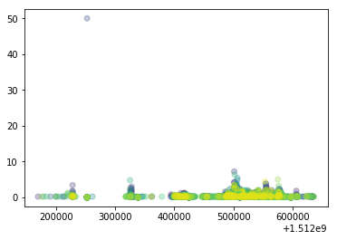

# Plotting with matplotlib

Python has powerful plotting capabilities with its built-in  `matplotlib` library. 

Up to now we have been vizualizing our plots *inline* of the IPython console. When working with spyder we can also show the figure in an extra window which allows us to dynamically edit our plot.
Which plotting ***backend*** to use can be set in the preferences. 

To change the ***backend*** go to *Preferences --> IPython console --> Graphics*.
Change the Graphic Backend to 'Automatic'.

Restart your IPython kernel and lets begin...
(you can restart the kernel under Consoles --> restart kernel or directly from the IPython console)


Before we begin let's import the `pandas` module and load in our data.

```python
import pandas as pd

rainfall_data = pd.read_csv('data/rainfall_combined.csv')
rainfall_data
```

Now let's import the `pyplot` module from the `matplotlib` library. 

```python
import matplotlib.pyplot as plt
```

`matplotlib`'s `pyplot` module is a powerful plotting tool that makes it simple to create complex plots from data. It uses default settings, which help creating publication quality plots with a minimal amount of settings and tweaking. The `matplotlib` documentation is found [here](https://matplotlib.org), and a useful Cheat Sheet [here](https://s3.amazonaws.com/assets.datacamp.com/blog_assets/Python_Matplotlib_Cheat_Sheet.pdf).

In previous episodes we plotted directly from our `pandas` Dataframe, e.g.:

```python
rainfall_data.plot(x='UT',y='data',kind='scatter')
```


We now want to look at a different approach to plot matplotlib graphics. We will use the so called object-oriented approach for more control and customization of our plots. We can build the plot step by step by adding new elements using *keyword* arguments.

To build a matplotlib plot we need to:

1. generate an empty figure object and assign it a _variable_ name
2. bind an axes object (a plot) to the figure and assign the axes object a _variable_ name
3. use a method for the axes object to plot the data (defines the kind of plot)
4. customize the plot with methods for the axes object and the figure object

```python
fig = plt.figure()
# checking the type of object fig
type(fig)
matplotlib.figure.Figure
```

This gives us an empty figure pane, next we can add a (sub)plot to this figure:

```python
ax = fig.add_subplot(111)
type(ax)
matplotlib.axes._subplots.AxesSubplot
```


Our figure now has an axes object, i.e. a (sub)plot with x and y axis. 

These first two steps can also be combined into one step:
```python
fig, ax = plt.subplots()
```

To plot our data we can now call the axes object we named `ax` with the kind of graph to plot, e.g. a scatter plot:

```python
ax.scatter(rainfall_data['UT'], rainfall_data['data'])
```


`scatter` is one of many functions that belong to the axes object we generated above.

Notes:

- In order to use the `scatter` function we **must** call it with _x_ and _y_ otherwise we will generate an error.
- A link to useful information on how to use the `scatter` plot function can be found [here](https://matplotlib.org/api/_as_gen/matplotlib.pyplot.scatter.html)


# Building your plots iteratively

We can now change the aesthetics such as point size, shape, color, etc.

For instance, we can add transparency to avoid overplotting using `alpha`:

```python
fig, ax = plt.subplots()
ax.scatter(rainfall_data['UT'], rainfall_data['data'], alpha=0.3)
```


We can also add a different colour for **all** the points using `c`:

```python
fig, ax = plt.subplots()
ax.scatter(rainfall_data['UT'], rainfall_data['data'], alpha=0.3, c='red')
```


Or color each raingauge in the plot differently:

```python
fig, ax = plt.subplots()
ax.scatter(rainfall_data['UT'], rainfall_data['data'], alpha=0.3, c=rainfall_data['raingauges_id'])
```


What do you see?
NOTE: In order to plot a different *colour* for each raingauge we had to tell the `plot` function to use the raingauges_id column.


> ## Challenge
>
> 1. Can you change the default colour scheme?
> (Hint: some useful links: [https://matplotlib.org/api/_as_gen/matplotlib.axes.Axes.scatter.html](https://matplotlib.org/api/_as_gen/matplotlib.axes.Axes.scatter.html), [https://matplotlib.org/examples/color/colormaps_reference.html](https://matplotlib.org/examples/color/colormaps_reference.html))
> 
> 2. Can you change the size of the points?
{: .challenge}

<!--
Answer:

```python
ax.scatter(rainfall_data['UT'],rainfall_data['data'],alpha=0.1,c='raingauges_id',cmap='jet')
```
-->


# Boxplot

The scatter plot we have just generated doesn't provide much detail on the characteristics of the dataset. So let's visualise the distribution of daily rainfall within each raingauge.

To do that, we first need to calculate the daily rainfall and reshape (_pivot_) our data, so that each raingauge is represented by one column. (Have a look in episode "Manipulating DataFrames with pandas" for more information on reshaping)

Remember the *pivot* function? 

```python
# group and reshape the data
rainfall_day = rainfall_data.groupby(['raingauges_id','day','region']).sum().reset_index()
rainfall_wide = rainfall_day.pivot(index='day',columns='raingauges_id',values='data')
```

Plot a boxplot

```python
# make the plot
fig, ax = plt.subplots()
ax.boxplot(rainfall_wide)
```

<!-- using pivot_table
rainfall_day_wide = rainfall_data.pivot_table(values='data', index='day', columns='raingauges_id', aggfunc='sum')
-->


> ## Challenge
> 1. Can you change the boxplot so that the outliers are not shown? HINT: use the *sym* keyword.
> 2. Make the boxes horizontal instead of vertical.
> 3. Boxplots are useful summaries, but hide the *shape* of the distribution. For example, if there is a bimodal distribution, this would not be observed with a boxplot. An alternative is a ***violinplot*** (sometimes known as a beanplot). Replace the box plot with a violinplot. Draw the violinplot and boxplot on top of each other.
> 
>> ## Could you solve nr 3?
>> It should look like this:
>> 
>> 
>> ```python
>> fig, ax = plt.subplots()
ax.boxplot(rainfall_wide)
ax.violinplot(rainfall_wide)
```
> {: .solution}
{: .challenge}

<!--Answer
1. ax.boxplot(rainfall_wide, sym='')
2. ax.boxplot(rainfall_wide, vert=False)
3. ax.violin(rainfall_wide)
to plot boxplot and violin plot on top of each other, do not do a new figure
4. - talk about na values if not done yet
-->

<!--
for different color:
```python
fig = plt.figure()
ax = fig.add_subplot(111)
bp = ax.boxplot(rainfall_wide, patch_artist=True)
for box in bp['boxes']:
    box.set_color('green')
```
-->


# Plotting time series data

We can also look at rainfall from individual raingauges using line plots. Let's only plot the first 5 raingauges:

<!--
```python
fig = plt.figure()
ax = fig.add_subplot(111)
ax.plot(rainfall_data['UT'], rainfall_data['data'])
```

Unfortunately this does not work, because we plot data for all the gauges
together. We need to tell pyplot to draw a line for each raingauge by grouping the data by raingauges_id. 
We will be able to distinguish gauges in the plot if we add colors.
-->

```python
fig, ax = plt.subplots()
ax.plot(rainfall_wide.iloc[:,0:5])
```

and we can add a legend:

```python
ax.legend(rainfall_wide.columns[0:5])
```


Note how we always call our axes object `ax` together with a method like `plot` or `legend` to add additional elements to the plot. This way we can also define axis labels, customise position and labels of axis ticks, add titles, add text and a lot more.

> ## Challenges
>
> 1. Can you add a y-label and a x-label?
> 2. Add a title!
> 3. Can you change the scale of the y-axis to a log-scale?
> 
> HINT: have a look [here](https://matplotlib.org/api/axes_api.html) for methods that are available for axes objects.
{: .challenge}


# Subplots

Remember how we added an axes object to the figure using `.add_subplot(111)`? The three 1's give us information on the subplots in the figure. The first two 1's describe a grid of subplots with no of rows and no of columns and the third 1 represents the no of the subplot defined, i.e. `.add_subplot(#rows#cols#subplot)`.
For instance, `.add_subplot(221)` defines the 1st plot of four subplots on a 2x2 grid, that is the one in the left upper corner, and `.add_subplot(224)` defines the 4th and last plot on a 2x2 grid, the one in the lower right corner.

Let's plot boxplots of the regions Southern, Northern, Central and Western in subplots. First we need to prepare the data again. We here prepare a dataframe for each region. We subset our `rainfall_day` dataframe per region and use `pivot` to reshape.

```python
rainfall_south = rainfall_day[rainfall_day.region=='Southern'].pivot('day','raingauges_id','data')
rainfall_north = rainfall_day[rainfall_day.region=='Northern'].pivot('day','raingauges_id','data')
rainfall_central = rainfall_day[rainfall_day.region=='Central'].pivot('day','raingauges_id','data')
rainfall_west = rainfall_day[rainfall_day.region=='Western'].pivot('day','raingauges_id','data')
```

<!--
```python
rainfall_south = rainfall_data[rainfall_data.region=='Southern'].pivot_table(index='day',columns='raingauges_id',values='data', aggfunc='sum')
```
-->

Define the figure and subplots:

We have to define one axes object for each subplot.

```python
fig = plt.figure()
ax1 = fig.add_subplot(221)
ax2 = fig.add_subplot(222)
ax3 = fig.add_subplot(223)
ax4 = fig.add_subplot(224)
```

This can also be done in a shorter way:

```python
fig, ([ax1, ax2], [ax3, ax4]) = plt.subplots(2, 2)
```

The data are plotted on each of the axes (the subplots):

```python
ax1.boxplot(rainfall_south)
ax2.boxplot(rainfall_north)
ax3.boxplot(rainfall_central)
ax4.boxplot(rainfall_west)
```


> ## Challenge
> 1. Can you add titles for each subplot?
> 2. Can you add x- and y-axis labels?
> 3. What do you notice in some of the subplots? The x-axis tick labels are not correct. Can you correct them? HINT: We want to use the index of our dataframe which holds our correct days as the xtick labels (remember when we reshaped our data the day was added as an index).
> 4. Make a figure with two subplots, one showing the boxplot of daily rainfall and one showing the histogram of daily rainfall. (Hint: use the `rainfall_day` dataframe and the column `data` for the histogram and use the reshaped dataframe `rainfall_wide` for the boxplot).
> 
>> ## How to change tick labels
>> ```python
>> ax1.set_xticklabels(rainfall_south.index)
>> ```
> {: .solution}
>> ## How to plot boxplot and histogram
>> ```python
>> # define figure with 2 subplots next to each other
>> fig, [ax1, ax2] = plt.subplots(1,2)
>> # plot the boxplot on ax1 (= left subplot)
>> ax1.boxplot(rainfall_wide)
>> # plot the histogram using the data column from rainfall_day dataframe on ax2 (= right subplot)
>> ax2.hist(rainfall_day['data'])
>> ```
>> 
> {: .solution}
{: .challenge}

<!--
1. ax1.set_title('Southern')
2. ax3.set_xlabel('day')
ax1.set_ylabel('rainfall (mm)')
3. ax1.set_xticklabels(rainfall_south.index)
-->


# Customization

Now, let's add an overall title for the figure and increase the space between subplots so that individual axis labels are readable.

```python
# add a figure title with large bold font
fig.suptitle('Daily rainfall per region', fontsize=14, fontweight='bold')
# add space between subplots
fig.subplots_adjust(hspace=0.5, wspace=0.3)
```


If you like the changes you created to the default theme, you can save them as
a python script to easily apply them to other plots you may create.

> ## Challenge
> Take a look at the matplotlib `text` documentation [here](https://matplotlib.org/users/text_intro.html), and
think of ways to improve the plot labels. You can write down some of your ideas as comments in the Etherpad.
{: .challenge}


# Exporting your plot
After creating your plot, you can save it to a file in your favourite format.
You can easily change format (png, pdf, eps ...) and resolution of your plot by
adjusting the appropriate arguments (`format`,  `dpi`):

```python
fig.savefig('my_first_plot.png',dpi = 120)
```

see more [here](https://matplotlib.org/api/_as_gen/matplotlib.pyplot.savefig.html)

Setting the size of the plot before saving also determines the font size:

```python
fig.set_size_inches(7,7) # set width and height
fig.savefig('my_second_plot.pdf') # save as pdf
```


> ## Final Challenge
> With all of this information in hand, please take another five minutes to either improve one of the plots generated in this exercise or create a beautiful graph of your own.
>
> Here are some ideas:
>
> * See if you can change thickness of the lines.
> * Can you find a way to change the name of the legend? What about its labels?
> * Use a different color palette (see [https://matplotlib.org/examples/color/colormaps_reference.html](https://matplotlib.org/examples/color/colormaps_reference.html))
> - Use the Matplotlib gallery for inspiration:
[https://matplotlib.org/gallery/index.html](https://matplotlib.org/gallery/index.html)
{: .challenge}


> ## Challenge optional
> Combine what we have learned so far. Use the different tables in the rainfall dataset to visualise information about the raingauges. Create a 'map' with the x- and y-locations of the raingauges and visualise the weekly rainfall from our sample data for each raingauge by e.g. using different sized symbols.
> 
>> ## How to start:
>> Make a list of the steps that need to be done.
>> Remember the structure of our data set? We have a table with the data and a table with the information about each raingauge including their locations.
>> 
>> 1. Load all necessary libraries.
>> 2. Read in the rainfall data table and the raingauge information table.
>> 3. Aggregate the rainfall data per week and per raingauge.
>> 4. Merge the aggregated rainfall data with the raingauge table.
>> 5. Make the plot.
> {: .solution}
>> 
>> ## How to make the plot?
>> You can use a scatter plot to plot the locations of the raingauges, location_x (= longitude) on the x-axis and location_y (=latitude) on the y-axis. Then you can define the size of the markers in the scatter plot to correspond to the weekly rainfall values.
> {: .solution}
> 
>> ## Solution
>> 
>> 1. load all necessary libraries
>> ```python
>> import pandas as pd
>> import matplotlib.pyplot as plt
>> ```
>> 2. load the data
>> ```python
>> rainfall_data = pd.read_csv('data/rainfall_combined.csv')
>> raingauges = pd.read_csv('data/raingauges.csv')
>> ```
>> 3. calculate weekly rainfall
>> ```python
>> rainfall_week = rainfall_data.groupby(['raingauges_id'], as_index=False)['data'].sum() 
>> # check resulting dataframe
rainfall_week.head()
>> ```
>> 4. merge weekly rainfall with raingauges
>> ```python
>> rain_merged = pd.merge(rainfall_week, raingauges, left_on='raingauges_id', right_on='id')
rain_merged.head()
```
>> 5. make the plot
>> ```python
>> fig, ax = plt.subplots()
ax.scatter(rain_merged['location_x'],rain_merged['location_y'], s=rain_merged['data'])
ax.set_xlabel('longitude')
ax.set_ylabel('latitude')
ax.set_title('Weekly rainfall of eThekwini raingauges')
ax.set_aspect('equal',adjustable='box')
>> ```
>> 
> {: .solution}
>
>> ## How to make a real map 
>> We can use the library [cartopy](https://scitools.org.uk/cartopy/docs/latest/) to produce real maps in python. The cartopy library does not come pre-installed with Anaconda, it can be installed with the conda package manager.
>> ```python
>> import cartopy.crs as ccrs
>> # create an empty plot with Plate Carree projection
ax = plt.axes(projection=ccrs.PlateCarree())
# add coastlines
ax.coastlines(resolution='10m', color='black', linewidth=1)
# add a grid with coordinates
ax.gridlines(crs=ccrs.PlateCarree(), draw_labels=True, alpha = 0.2) 
# set the limits of the grid to fit with our data
ax.set_xlim(round(min(rain_merged.location_x),1)-0.1,round(max(rain_merged.location_x),1)+0.1)
ax.set_ylim(round(min(rain_merged.location_y),1)-0.1,round(max(rain_merged.location_y),1)+0.1)
# plot the locations of the raingauges with the rainfall as size
plt.scatter(rain_merged.location_x, rain_merged.location_y, s=rain_merged.data)
>> ```
>> 
> {: .solution}
{: .challenge}
 